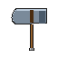
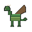
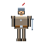
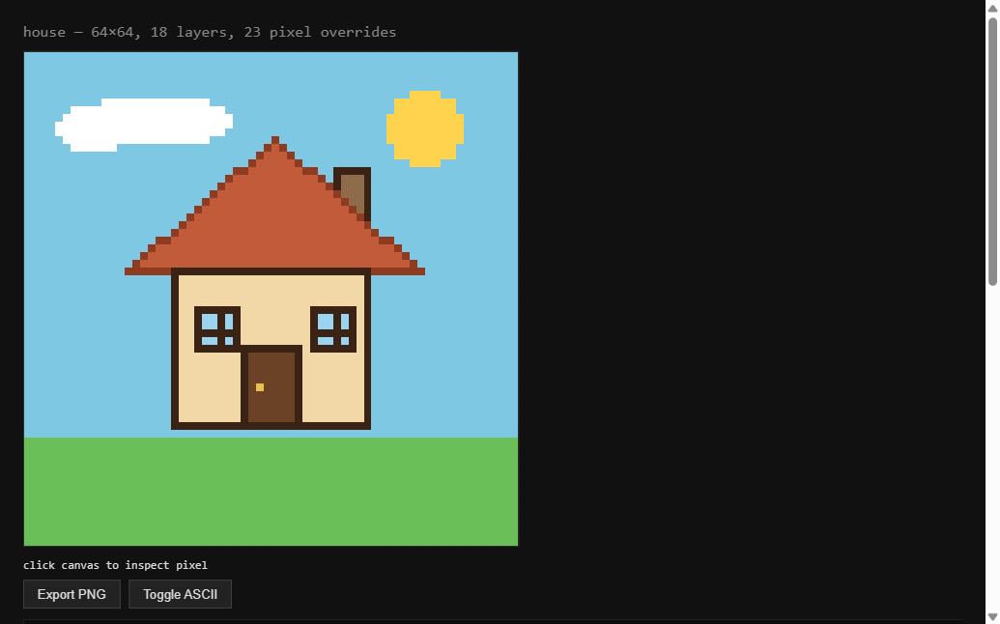
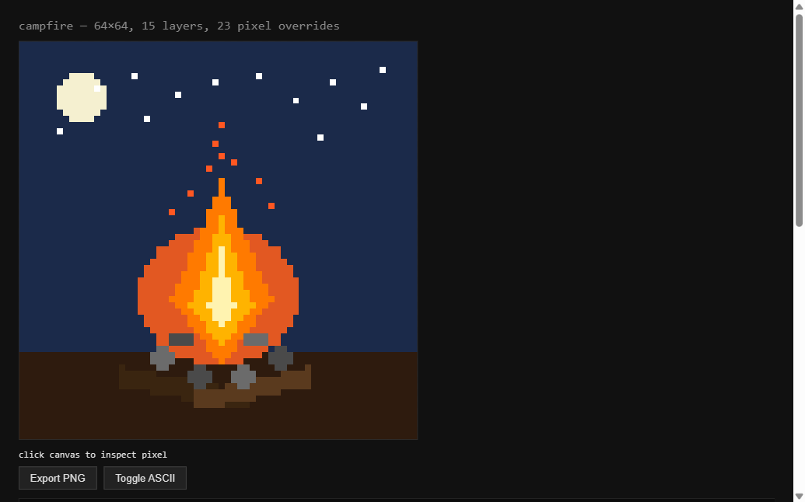

# pixel-engine

[](https://www.npmjs.com/package/pixel-engine-zero)
[](https://www.npmjs.com/package/pixel-engine-zero)
[](https://www.npmjs.com/package/pixel-engine-zero)
[](https://github.com/beast-ofcourse/pixel-engine/blob/main/LICENSE)
[](https://github.com/beast-ofcourse/pixel-engine)
[](https://bundlephobia.com/package/pixel-engine-zero)
[](https://nodejs.org)

**A coding LLM constructs 64×64 pixel art from a structured scene document — layers, palette, and sparse pixel overrides — instead of emitting pixels one by one.**

This is an **experimental research prototype**, not a product. The question it exists to answer:

> How far can a normal language/coding model go at constructing a visual artifact when given a good intermediate representation, tools, and iterative feedback?

The engine is a single zero-dependency file that works in Node and the browser. It rasterizes a declarative scene document to a pixel buffer, renders it to PNG, and exposes inspection tools (ASCII previews, color stats, region zoom) so an agent can render → inspect → fix → re-render without ever reasoning about all 4,096 pixels at once.

## How it works — in plain English

A pixel-art image is just a grid of tiny colored squares. A 64×64 image has **4,096** of them. If the AI tried to decide each square one by one, it would drown — and the result would be a mess.

So the engine flips the problem: **the AI writes a recipe, and the engine does the cooking.** The AI never touches individual pixels. It writes a short list of instructions — "draw a green blob here, a lighter belly here, a dark outline around the whole thing" — and the engine turns that recipe into the finished picture. The AI reasons about **15–20 shapes** instead of 4,096 pixels.

### The recipe (a "scene document")

Every picture starts as a small text file with three parts:

1. **The canvas** — how big the picture is (16×16, 32×32, 64×64…).
2. **The palette** — the paint colors, each given a name, like a paint-by-numbers kit. The AI says "paint this shape `skinMid`" — it never types a color code. Change one line and every pixel using that color updates.
3. **The layers** — the actual instructions, in order. Each layer is one shape: "draw a polygon here in `skinMid`".

### Layers = stacked glass sheets

Imagine each layer is a **sheet of glass with paint on it**, stacked on top of each other. Anything painted on a higher sheet **covers** what's beneath it. That's why order matters: the lizard recipe draws the body, then the belly, then the shadow, then the legs (so the shadow can't swallow them), then the highlight, then the outline **last** — one thin line around the whole creature, on top of everything.

### The shapes the engine knows

Eight kinds of instructions, like a box of stencils:

- **fill** — paint the whole canvas one color (the sky, the background)
- **rect** — a solid rectangle (a chest, a building)
- **rectout** — just the rectangle's outline (a window frame)
- **ellipse** — a circle or oval (a coin, a potion)
- **line** — a straight line
- **poly** — any many-sided shape (the workhorse for organic things: creatures, flames, tails)
- **polyout** — just the outline of a many-sided shape (the dark contour around a creature)
- **curve** — a smooth filled shape that flows through points (a leaf, a droplet, an organic blob)

The engine figures out exactly which squares each shape covers — including the tricky math of filling a weird polygon — and paints them. The AI just picks the right stencil.

### The "eyes" — how the AI sees what it made

The engine doesn't just draw; it gives the AI **eyes** to check its own work: a text preview of the whole picture, per-color pixel counts and positions, and a magnifying glass that zooms into any region at full resolution. Then the loop: **render → look → fix → render again**. The AI draws, spots a problem (the shadow covered the belly!), fixes one line of the recipe, and re-renders.

### Animation — copy, tweak, repeat

Animation uses the same recipe idea, even simpler. The AI draws one good frame (the "keyframe"), **copies** it, **moves one thing** in the copy, and checks the difference — the engine reports exactly which pixels changed. The difference between two frames **is** the motion. So animation becomes: copy → tweak → check → repeat.

### Why this works

Because the AI is never staring at 4,096 pixels. It's writing a recipe, checking the result through the engine's eyes, and fixing the recipe. The engine handles the pixel-level drudgery — filling polygons, stacking layers, counting colors, diffing frames — and the AI handles the judgment: what shape, what color, what order, what looks good.

## Showcase

### Benchmark asset set — the best work so far

A coherent 10-asset ladder (16×16 → 64×64) authored with the render → inspect → fix loop, hash-locked by the test suite, and coherence-reviewed so the whole set reads as one artist's style (shared near-black outlines, upper-left lighting, and material palette families). Each asset has an experiment record in `docs/experiments/` (iterations, pixel modifications, palette usage, final assessment).

**Level 1 — basic objects (16×16)**

| Coin | Potion | Sword |
|---|---|---|
|  |  |  |

**Level 2 — weapons & tools (32×32)**

| Axe | Chest | Torch |
|---|---|---|
|  |  |  |

**Level 2 — weapons & tools (64×64)**

| Sword | Axe |
|---|---|
|  |  |

**Level 5/6 — creature & character (64×64)**

| Dragon | Knight |
|---|---|
|  |  |

All 10 are hash-locked in `tests/test-suite.js` with full SHA-256 digests — any pixel change fails the suite.

### Earlier scenes

The first five scenes authored and verified with this loop (see [docs/FINDINGS.md](docs/FINDINGS.md) for the full experiment log, token economics, and the bugs found):

| House — 64×64, 18 layers | Campfire — 64×64, 15 layers | House 2× — 128×128, 55 layers |
|---|---|---|
|  |  | render via `node cli.js scenes/house128.json --png out/house128.png` |

| Robot — 128×128, 28 layers | Landscape — 256×256, 111 layers |
|---|---|
| render via `node cli.js scenes/robot.json --png out/robot.png` | render via `node cli.js scenes/landscape256.json --png out/landscape256.png` |

All five were verified pixel-exact in a real browser (canvas-sample SHA-256
== Node rasterize hash, 0 diffs) and are hash-locked by the test suite.

### Animation

The same scene documents become frames. `animations/ball.json` is a 16×16,
4-frame bounce (8 fps, frame-0 keyframe) built by duplicating a frame and
moving the ball layer; consecutive-frame diffs are exactly 30 pixels. Play it
in a browser: `out/ball.html` (play/pause/restart/step, fps control,
click-to-inspect, spritesheet export).

## How it works — technical details

```
scenes/<name>.json          ← the agent's artifact: a structured scene document
    ↓
engine/pixel-engine.js      ← rasterizer + tools + PNG encoder (zero deps)
    ↓
cli.js                      ← render → inspect → zoom loop
out/<name>.png / .html      ← exports + interactive preview

animations/<name>.json      ← frames = scene documents + fps + keyframes
    ↓
engine/animation.js         ← frame ops, exact diffing, validation, spritesheets
    ↓
cli.js anim ...             ← diff → validate → export loop
out/<name>.html / -sheet.png
```

A scene document is plain JSON:

```json
{
  "size": 64,
  "palette": { "sky": "#7EC8E3", "roof": "#C25B3A" },
  "layers": [
    { "id": "sky", "type": "fill", "color": "sky" },
    { "id": "roof", "type": "poly", "points": [[13,28],[51,28],[32,11]], "color": "roof" }
  ],
  "pixels": { "25,36": "dark", "30,43": "gold" }
}
```

- **Layers** are named shapes painted in order (painter's algorithm): `fill`, `rect`, `rectout`, `ellipse`, `line`, `poly`, `polyout`, `curve`.
- **Colors** are palette keys, never raw hex — the palette guarantees consistency and makes `inspect()` stats readable.
- **`pixels`** is a sparse override map for sub-shape detail (window crosses, door knobs, stars). `null` clears.

The agent reasons about ~15–20 objects instead of 4,096 pixels.

## Install

```bash
npm install pixel-engine-zero
```

As a library:

```js
const PE = require('pixel-engine-zero');

const scene = {
  size: 64,
  palette: { "sky": "#7EC8E3", "roof": "#C25B3A" },
  layers: [
    { "id": "sky", "type": "fill", "color": "sky" },
    { "id": "roof", "type": "poly", "points": [[13,28],[51,28],[32,11]], "color": "roof" }
  ],
  pixels: {}
};

const rgba = PE.rasterize(scene);      // Uint8Array RGBA buffer
const png = PE.encode_png(scene);      // Uint8Array PNG bytes
console.log(PE.read_region(scene));    // ASCII preview
console.log(PE.inspect(scene));        // color stats + bboxes
```

As a CLI (or `npx pixel-engine-zero`):

```bash
pixel-engine scenes/house.json --png out/house.png --html out/house.html
```

## Requirements

- Node.js (developed and tested on v24.18.0; only built-in modules are used — no dependencies)

## Quick start

```bash
# Render a scene to PNG + interactive HTML preview
node cli.js scenes/house.json --png out/house.png --html out/house.html

# Full inspection loop: stats + auto-scaled ASCII preview + full-res zoom
node cli.js scenes/house.json --zoom 19,28,26,21

# Browser sandbox (paste JSON → render → click pixels → export PNG)
node serve.js
# then open http://localhost:8734

# Run the accuracy suite (264 tests: primitives, edge cases, PNG, hashes, CLI, animation, agent-loop, taste, registries)
node tests/test-suite.js
```

The CLI prints color stats (count + bounding box per color), a full-canvas ASCII preview (auto-scaled to ≤40 chars wide to keep context small), and optionally a full-resolution zoom region or per-color counts for a region.

## Animation

An animation document is plain JSON: `width`, `height`, `fps`, `palette`,
`keyframes`, and `frames` — each frame is an ordinary scene document. The
authoring model is **duplicate + modify**: copy a frame, make localized
changes, and the diff between consecutive frames *is* the motion.

```json
{
  "width": 16, "height": 16, "fps": 8,
  "palette": { "bg": "#1A1A2E", "ball": "#E94560" },
  "keyframes": { "frame-0": true },
  "frames": [
    { "id": "frame-0", "scene": { "size": 16, "palette": { "bg": "#1A1A2E", "ball": "#E94560" },
        "layers": [ { "id": "bg", "type": "fill", "color": "bg" },
                    { "id": "ball", "type": "ellipse", "cx": 8, "cy": 5, "rx": 3, "ry": 3, "color": "ball" } ],
        "pixels": {} } },
    { "id": "frame-1", "scene": { "size": 16, "palette": { "bg": "#1A1A2E", "ball": "#E94560" },
        "layers": [ { "id": "bg", "type": "fill", "color": "bg" },
                    { "id": "ball", "type": "ellipse", "cx": 8, "cy": 7, "rx": 3, "ry": 3, "color": "ball" } ],
        "pixels": {} } }
  ]
}
```

The agent's loop: `diff_frames` reports exactly which pixels changed (count,
percentage, bounding box, per-pixel old/new values); `validate_change` checks
the change against an allowed region (PASS/FAIL with the unexpected list);
`animation_to_html` gives a playable preview; `encode_spritesheet` exports a
PNG sheet (an export format only — never the internal representation).

```bash
# Diff two frames, validate a change region, preview a frame, export
node cli.js anim animations/ball.json --diff frame-0,frame-1
node cli.js anim animations/ball.json --validate frame-0,frame-2,5,2,7,11
node cli.js anim animations/ball.json --ascii frame-0
node cli.js anim animations/ball.json --sheet out/ball-sheet.png --html out/ball.html
```

## CLI reference

```text
node cli.js <scene.json> [--png out.png] [--html out.html]
                        [--zoom x,y,w,h] [--counts x,y,w,h] [--scale n]
node cli.js anim <anim.json> [--diff a,b] [--validate a,b,x,y,w,h]
                             [--ascii frameId] [--sheet out.png] [--html out.html] [--fps n]
```

| Flag | Purpose |
|---|---|
| `--png <path>` | Write a PNG export |
| `--html <path>` | Write a self-contained interactive preview (click pixels to inspect, export PNG) |
| `--zoom x,y,w,h` | Full-resolution ASCII read of a region |
| `--counts x,y,w,h` | Per-color pixel counts in a region |
| `--scale n` | Override ASCII preview sampling (default: auto) |

## Engine API

`engine/pixel-engine.js` is a UMD module: `require('./engine/pixel-engine.js')` in Node, `window.PixelEngine` in the browser.

| Function | Purpose |
|---|---|
| `create_canvas(size, background)` | New scene document |
| `fill_region(scene, x, y, w, h, color)` | Filled rect layer |
| `draw_shape(scene, type, params)` | Generic shape layer |
| `set_pixel(scene, x, y, color)` / `clear_pixel` | Sparse override |
| `get_pixel(scene, x, y)` | Resolved color at a coordinate |
| `mirror_region(scene, x, y, w, h, axis)` | Mirror a region across its centerline (h/v), writes overrides |
| `replace_color(scene, from, to)` | Document-level recolor by palette key or hex |
| `flood_fill(scene, x, y, color, tolerance?)` | Fill the 4-connected region of the seed's color, writes overrides |
| `draw_cluster(scene, x, y, pattern, color)` | Paint a reusable pixel pattern (offsets or string grid), writes overrides |
| `move_region(scene, x, y, w, h, dx, dy)` / `copy_region(scene, x, y, w, h, dx, dy)` | Move/copy a region's opaque pixels, writes overrides |
| `extract_outline(scene, region?)` | Boundary pixels `[{x, y}]` of the painted silhouette (4-neighbor transparent/out-of-canvas/out-of-region) |
| `poly_union(a, b)` / `poly_subtract(a, b)` | Combine polygon point arrays (single contour; disjoint union concatenates both, holes not representable) |
| `read_region(scene, x, y, w, h, opts)` | ASCII map or color counts (multi-resolution) |
| `inspect(scene)` | Per-color counts + bounding boxes |
| `render(scene)` | RGBA pixel buffer |
| `encode_png(scene)` / `export_png(scene, path)` | PNG bytes / file |
| `encode_png_buffer(rgba, w, h)` | PNG bytes for an arbitrary RGBA buffer (spritesheets) |
| `encode_apng_buffer(frames, w, h, opts)` | APNG bytes from frame buffers (opts: `fps`, `loop`) |
| `decode_png(bytes)` | PNG import: `{ width, height, rgba }` (Node zlib backend; 8-bit RGB/RGBA/palette) |
| `quantize_palette(rgba, maxColors?)` | Median-cut palette extraction: `{ palette, indices }` (default 16, `-1` = transparent) |
| `validate_scene(scene)` | Scene integrity: `{ valid, errors[] }` (size ladder, palette 5–12, layer/pixel bounds) |
| `diff_scenes(a, b)` | Scene diff: `{ changed, unchanged, pct, bbox, changes[] }` (+ `changed_pixels` etc. aliases) |
| `replace_color_region(scene, x, y, w, h, from, to)` | Buffer-level recolor in a region (clamped; empty/from===to → no-op) |
| `measure_distance(x1, y1, x2, y2)` | Euclidean distance |
| `check_symmetry(scene, axis, region?)` | Symmetry check: `{ symmetric, diffCount, diffPixels[] }` |
| `dither_region(scene, x, y, w, h, opts)` | Bayer 4×4 ordered dithering `{ from, to }` (gradient left→right) |
| `compare_scene_to_reference(scene, refRgba, opts?)` | Reference comparison: silhouette IoU, palette & histogram distance (auto-scales ref) |
| `analyze_values(scene)` / `check_hue_shift(palette)` | Craft checks: value steps & hue-shifted shading per family |
| `encode_compact(scene)` / `decode_compact(compact)` | Compact encoding `{ s, p, l, x }` (short keys, palette indices, flat points, 40% saving) |
| `get_patch(oldScene, newScene)` / `apply_patch(scene, patch)` | Patch-first loop: terse diff (<30% of full scene), hard-stop at 5 iterations |
| `scene_to_html(scene, opts)` | Interactive preview HTML |

`engine/animation.js` (load after pixel-engine; attaches to the same object):

| Function | Purpose |
|---|---|
| `create_animation(w, h, opts)` / `normalize_animation(anim)` | New / loaded animation document |
| `add_frame(anim, scene?)` / `duplicate_frame(anim, id)` / `delete_frame` | Frame lifecycle (duplicate = deep copy) |
| `resolve_frame(anim, id)` | RGBA buffer of a frame |
| `set_frame_pixel` / `get_frame_pixel` / `clear_frame_pixel` / `fill_frame_region` | Frame pixel ops (delegate to the engine) |
| `move_frame_region` / `copy_frame_region` | Region moves/copies between frames |
| `set_keyframe` / `is_keyframe` | Keyframe markers |
| `diff_frames(anim, a, b)` | Exact diff: changed/unchanged counts, %, bbox, per-pixel changes |
| `validate_change(anim, a, b, region)` | PASS/FAIL against an allowed region + unexpected list |
| `frame_palette` / `palette_drift` | Resolved color usage / palette consistency |
| `encode_spritesheet(anim, opts)` / `export_spritesheet` | PNG sheet (export only) |
| `encode_apng(anim, opts)` / `export_apng(anim, path, opts)` | APNG animated export (lossless; opts: `fps`, `loop`) |
| `encode_gif(anim, opts)` / `export_gif(anim, path, opts)` | GIF89a animated export (≤256 unique colors; more → error) |
| `animation_to_html(anim, opts)` | Self-contained playback preview |

## Project structure

```text
engine/pixel-engine.js   engine + tools (~700 lines, zero deps)
engine/animation.js      animation subsystem: frames, exact diffing, validation, spritesheets
tests/test-suite.js      264-test accuracy suite (node tests/test-suite.js)
cli.js                   render/inspect/zoom/export driver + anim subcommand
serve.js                 zero-dependency static server for the sandbox
prototype.html           browser sandbox
scenes/                  experiment scenes (64×64 house/campfire, 128×128 house128/robot, 256×256 landscape, 10-asset benchmark ladder)
docs/experiments/        per-asset experiment records for the benchmark ladder
docs/FINDINGS.md         experiment log, failures, research answers
animations/ball.json     16×16, 4-frame bounce (8 fps, keyframe-0)
out/                     generated PNGs, previews, screenshots (incl. out/benchmark/)
```

## Status and next steps

The 64×64 baseline is validated and **hash-locked by a 264-test accuracy
suite** — any engine change that moves a single pixel fails the run. The
representation scales: 128×128 and 256×256 scenes were authored and verified
pixel-exact (including a 2× upscale of the house), the animation subsystem
(milestone 1: 16×16, 2→4 frames, exact diffing, region validation, playback
preview, spritesheet export) is implemented and hash-locked, and the
**10-asset benchmark ladder** (coin, potion, sword, axe, chest, torch, sword,
axe, dragon, knight — 16×16 → 64×64) is authored, coherence-reviewed, and
hash-locked.

Documented next experiments (in `docs/FINDINGS.md` and `docs/plans/tasks.md`):

1. Animation quality pass (§16): silhouette/palette stability, intentional motion
2. Stress the repair loop: deliberately flawed scenes, measure render→inspect→fix cycles
3. Optionally expose the tool API as MCP tools
4. Animation milestones: 8/12/24-frame scenes, layered motion, walk cycles

## Known limitations

- Experimental prototype: the npm package is published via `scripts/release.js` (CI runs the suite on Node 18/20/22)
- PNG encoder uses a hand-rolled fixed-Huffman DEFLATE (RFC 1951) — byte-valid
  (round-trip verified against zlib), but not the most compact compression
- ASCII inspection is the agent's primary "eyes" — pixel probes and `inspect()` stats are more reliable than eyeballing ASCII rows (see FINDINGS §5)
- Animation frames are complete scenes (deltas are computed, not stored);
  `move_frame_region`/`clear_frame_pixel` erase by revealing the layers
  beneath — to erase over a filled background, fill the region with the
  background color instead
- Frames are square like scenes (the engine rasterizes square canvases)